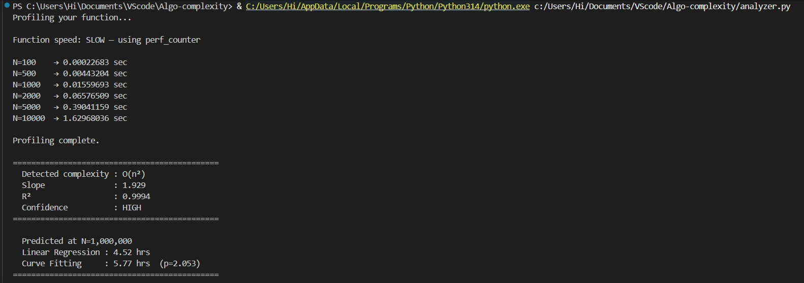
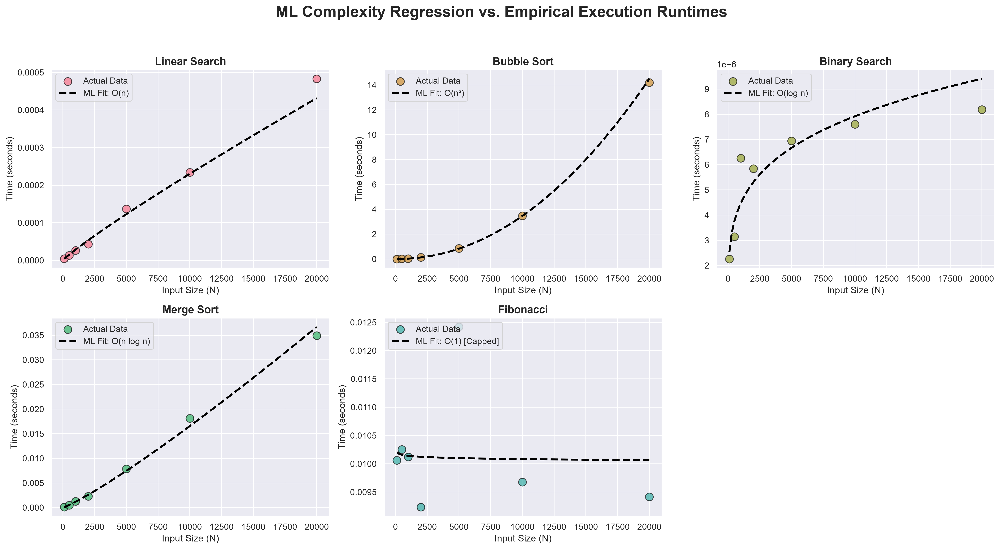
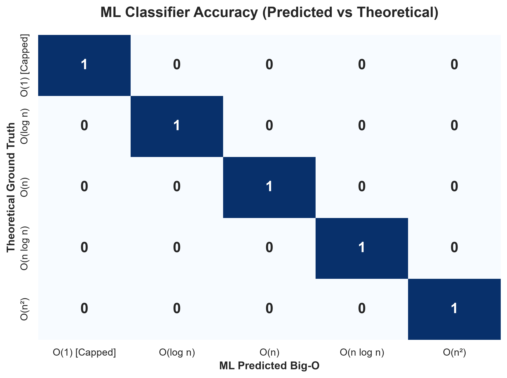

# Algo Complexity Analyzer

An ML pipeline that empirically profiles algorithm runtimes, predicts Big-O complexity using log-log regression, and forecasts execution time at infeasible input sizes using curve fitting and linear regression.


## Demo

Paste your function in `user_function.py` and run:

```bash
python analyzer.py
```

**Example — detecting O(n²) in a duplicate-check function:**



**Visualization — ML fit vs actual runtime:**






## How It Works

### Step 1 — Empirical Profiling
Each function is run across multiple input sizes N = [100, 500, 1000, 2000, 5000, 10000].
Timing is averaged over 7 trials to reduce noise. Fast functions (< 0.1ms) 
automatically use `timeit` with 2000 repetitions for stable nanosecond measurements.
Slow functions use `time.perf_counter` with fresh unique input arrays each trial 
to guarantee worst-case behavior.

### Step 2 — Log-Log Regression (Complexity Classification)
If an algorithm is O(nᵖ), then:
time = c × nᵖ
log(time) = log(c) + p × log(n)
This is a straight line in log-log space with slope = p.
We fit this line using `np.polyfit` and match the slope to the nearest known complexity class:

| Slope | Complexity |
|-------|------------|
| ~0.0  | O(1)       |
| ~0.3  | O(log n)   |
| ~1.0  | O(n)       |
| ~1.1  | O(n log n) |
| ~2.0  | O(n²)      |

R² is computed on the log-log fit to measure confidence. R² ≥ 0.85 → HIGH confidence.

### Step 3 — Runtime Prediction at N = 1,000,000
Two independent methods predict runtime at scales never actually profiled:
- **Linear Regression** — trains on the dominant complexity feature (e.g. n² for bubble sort) and extrapolates
- **Curve Fitting** — directly fits `time = c × nᵖ` via `scipy.optimize.curve_fit`

Agreement between both methods validates the prediction. The exponent `p` 
from curve fitting independently confirms the complexity class detected in Step 2.

### Note on Exponential Algorithms (O(2ⁿ))
Truly exponential algorithms like naive Fibonacci are **infeasible to 
profile empirically** — `fib(50)` would take years to compute.

We cap the workload at `fib(25)` regardless of input size N. As a result, 
the profiler correctly detects near-constant runtime and classifies it as 
O(1) — which is honest: the *profiled workload* is constant, even though 
the *theoretical complexity* is O(2ⁿ).

This is a deliberate design decision, not a bug. In practice, exponential 
algorithms are identified via theoretical analysis, not empirical profiling.


## Results

### Complexity Classification

| Algorithm | True Complexity | Predicted | Slope | R² | Confidence |
|-----------|----------------|-----------|-------|----|------------|
| linear_search | O(n) | O(n) | ~1.0 | 0.99 | HIGH |
| bubble_sort | O(n²) | O(n²) | ~2.0 | 0.99 | HIGH |
| binary_search | O(log n) | O(log n) | ~0.26 | 0.93 | HIGH |
| merge_sort | O(n log n) | O(n log n) | ~1.1 | 0.99 | HIGH |
| fibonacci | O(2ⁿ) | O(1) [Capped] | ~0.0 | LOW | — |

### Runtime Prediction at N = 1,000,000

| Algorithm | Linear Regression | Curve Fitting | p value |
|-----------|------------------|---------------|---------|
| linear_search | 0.024 sec | 0.022 sec | 0.983 |
| bubble_sort | 9.86 hrs | 11.14 hrs | 2.031 |
| binary_search | 0.013 ms | 0.019 ms | 0.199 |
| merge_sort | 2.47 sec | 2.12 sec | 1.047 |
| fibonacci | Instantly (Capped) | Instantly (Capped) | — |
